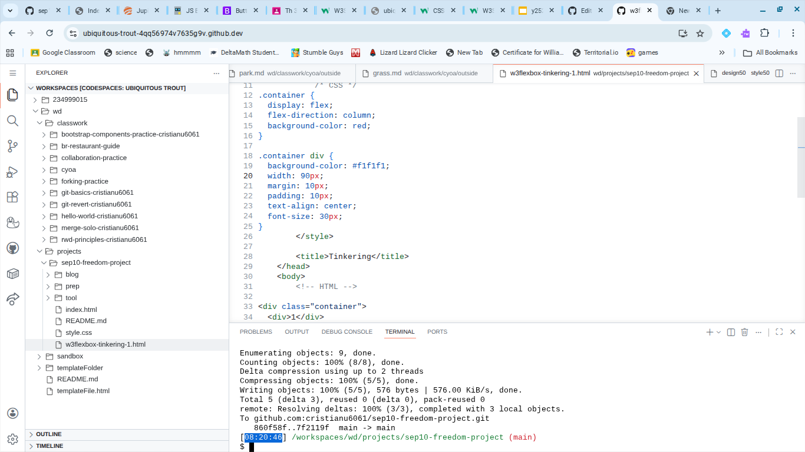
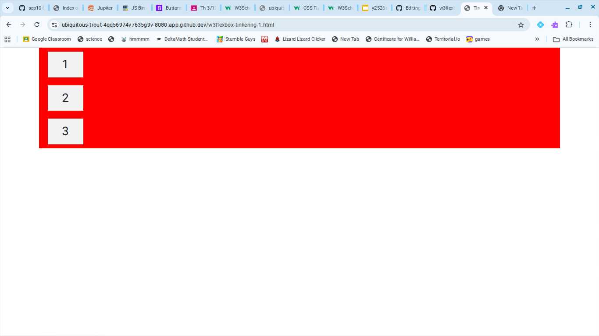

# Entry 4
##### 3/13/26

## Content 
Since blog 3, I have been finding a tool to create my construction website. I have picked W3Schools Flexbox. To try it out, I used my knowledge of css and html to create column with boxes. I then made the background red. To make the boxes into a column, I used `flex-direction:column`. To make the boxes, I made a container div with a grey background color and didn't make the width too big so it would fit nice. I then put the div on some text. My work is shown below:

The preview of my tinkering is also shown below:

# Sources

[Previous](entry03.md) | [Next](entry05.md)

[Home](../README.md)
