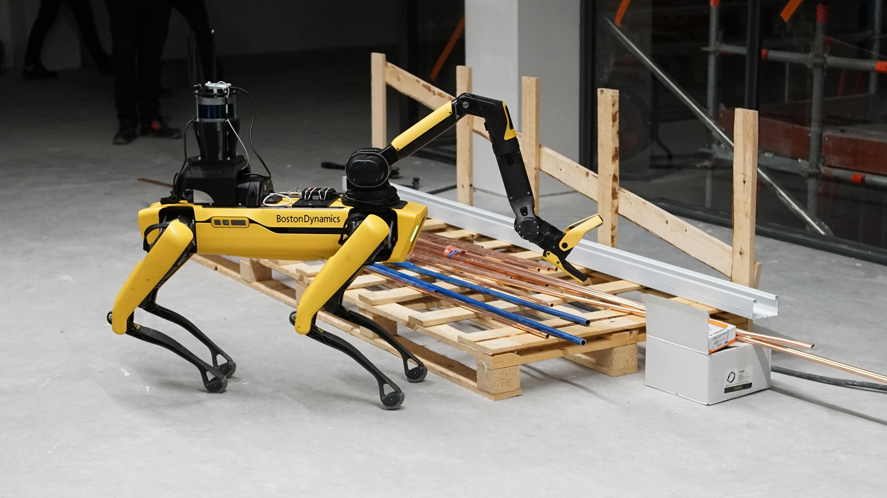
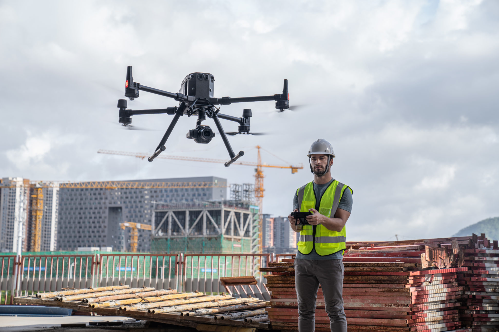

# Content
Topic: **X**

## Overview/Introduction/Context
* Construction is a field of work that has created all the buildings and furnature that you see around you everyday.
* The technology for construction is progessing rapidly in this century. I will show you apps and hardware I have found that have been made for construction.
* I found 2 websites. One was called <a link href="https://www.dustyrobotics.com/articles/what-is-construction-technology"> Dusty Robotics </a> that had catagories of technology. It had robotics, 3D printing and drones. 2nd website was called <a link href="https://thedigitalprojectmanager.com/tools/best-construction-project-management-software/"> DPM</a> that had websites that helped in construction. It had websites like <a link href="https://contractorforeman.com/?utm_source=crozdesk&utm_medium=paid&utm_campaign=list"> Contractor Foreman</a>, <a link href="https://monday.com/lp/project-management?utm_medium=cpc&utm_source=dpm&utm_adgroup=best_construction_project_management_software&utm_campaign=ww-multi-prm-work_mgmt">monday.com</a> and <a link href="https://crewcost.com/?utm_campaign=25151856-Referral%20Sites&utm_source=The%20Digital%20Project%20Manager"> Crew Cost</a>.
* I will also talk about new inventions for construction in the future.
  
# Existing Technology
## Catagories
 ### Contractor
  * **<a link href="https://contractorforeman.com/?utm_source=crozdesk&utm_medium=paid&utm_campaign=list"> Contractor Foreman</a>:**
  * paid service
  * training service to become a good contractor
  * organizes estimates, expenses, bills, etc.  
  * calander for meetings, calls, incidents, etc.  
  * has templetes for documents and has custom PDF language feature
 
  * **<a link href="https://crewcost.com/?utm_campaign=25151856-Referral%20Sites&utm_source=The%20Digital%20Project%20Manager"> Crew Cost</a>:**
  * can be used on computer 
  * good for managing projects
  * paid service
  * organizes profits and expenses
  * website strictly for construction so it isn't confusing
    
  * **<a link href="https://monday.com/lp/project-management?utm_medium=cpc&utm_source=dpm&utm_adgroup=best_construction_project_management_software&utm_campaign=ww-multi-prm-work_mgmt">monday.com</a> :**
  * helps manage simple tasks
  * simple to use
  * free
  * very organized and versitile
  * other options such as collaborating
  
  
  ### Construction Worker
  * **3D printing:**
  * decreases costs for materials
  * decreases building time
  * makes complex designs
  * makes parts for buildings or furnature
    
    
  * **Robotics:**
  * Robotics helps in demolition, laying materials, and excavation
  * because robotics does all those things, employee safety improves a lot
  * reduces manual labor
  * increases efficiency
  * lets construction workers focus on less physically demanding tasks

    
  ### Inspectors
  * **Drones:**
  * Drones inspect active and potential sites
  * Drones are safer for inspections bc if something were to happen to the drone you can make another one
  * More efficient bc they can look into more smaller spaces that a human cannot

# Future Inventions
## EXTENDING BOOTS 
* Boots that help workers reach high places
* Good for safety since a ladder can fall
* Much more easier than a ladder

## AI Managers
* AI Robots that manage all taxes, estimates, etc.
* Good for fast organization
* Less time consuming

## Holographic Projection
* A device that displays building ideas right in front of you
* Good for seeing what your design would actually look like on the build site
* Good to see what flaws would be in your design so you can avoid building

# Self Healing Buildings
* Buidings that automatically fix damage
* Much less time consuming for repairs
* Way more cheaper in the long run
* More safer because there wont be a risk of the building collapsing

# Nanotech Armor
* Advanced armor for construction workers
* Can save lots of lifes
* Nanotech so it can block the sharpest of tools
* Nanotech armor robots can travel to all parts of the body to prevent all accidents

