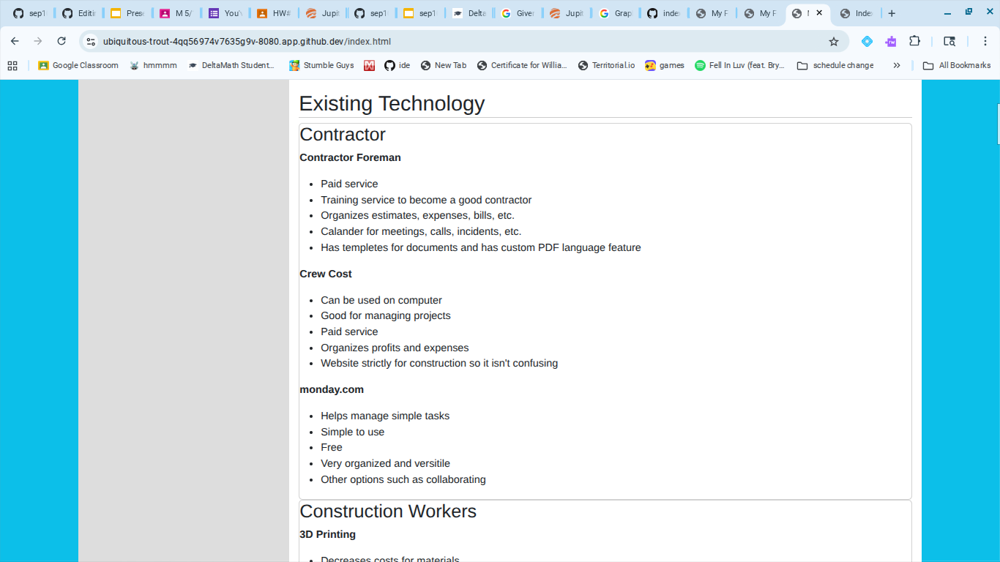

# Presentation Plan

## Hook
* Do you know there are 173,200 construction accidents a year? Maybe there would be less if people just looked at my freedom project.


## Product
* This is my <a href="https://cristianu6061.github.io/sep10-freedom-project/">final project</a>. My project is on construction technology. My project is about future technology and present technology. One of my future technologies is extending boots. This allows for workers to use ladder-like boots that extend to let workers reach high heights without risks of falling. 

## Process
* This project was a very long process. I first had to research about existing technology. I labeled this "existung technology" and looked up differetn softwares and hardwares that already existed for construction. After I found existing technology, I then came up  with 5 ideas for the future which I named this "Future Inventions". After this, I had to learn a tool to use for my project. So, I learned a tool called flexbox. Flexbox basically lets you learn how to create rows and columns and allows you to make cards with these rows and columns. I learned how to use different flexbox codes. For example `<div style="order: 2">1</div>`, `<div style="flex-grow: 3">hi</div>` and `<div class="column-container"> <div>hi</div> </div>`. In order to make the actual card css for flexbox, I did:
```CSS
   .container {
    display: flex;
    background-color: red;
    }
    .container div {
  background-color: #f1f1f1;
  color:#000;
  width: 100px;
  margin: 10px;
  padding: 10px;
  text-align: center;
  font-size: 30px;
    }
```
* After this, I then needed to make a plan for how my website would look. So I started planning my design and came up with the design of my project.

## Conclusion
* Throughout this project, I learned how to use tools effectively to help me. Flexboxes containers helped me create cards to put my content in. Without it my content would look a mess. If my website didn't have cards it would look like this:


It looks basic and bland
* Overall, this project has made me really learn to be creative and I hope this project will inspire others to be creative too. Thank you for listening.

<!-- EXAMPLE

## Hook
* Verbal riddle of GGD

## Product
* GIF/Demo of example/non-example

## Process
* Flowchart of plan
  * MVP: noun -> door -> yes/no
  * Beyond MVP: noun -> word relation API -> noun API -> yes/no, with counterexample
* Code snippets of:
  * MVP
  * Both APIs
  * Challenge with API keys

## Conclusion
* [URL to project]
* Takeaways
  * Less = more: the heart of the riddle was one line of code; it obviously took more to make the entire thing work, but one complicated line of regular expressions was essentially the solution to the riddle
  * Expect the unexpected: it’s important to budget time for things you don’t account for; for example, I didn’t consider the fact that I would need another entire API to detect nouns
  * Determination is key: ironically enough, I had to make my API keys private. At first, it didn’t seem like it was possible, which meant I couldn’t publish my app. But after all of that hard work, I was determined to find a solution, and I found it in config variables.
* "Presentation can’t, but a speech can"


-->
